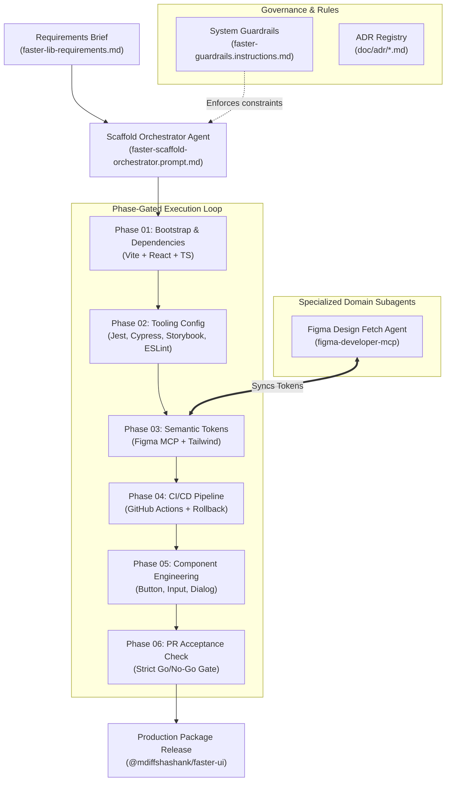

# ADR-0003: Agentic Multi-Phase Implementation Framework

## Status

Accepted

## Date

2026-08-20

## Context

The **Faster UI Component Library** was commissioned as a production-grade, design-system-aligned React library consisting of core components (`Button`, `Input`, `Dialog`), tokenized Tailwind CSS styling, Jest/RTL unit tests, Cypress component tests, Storybook documentation, and an automated GitHub Actions CI/CD release pipeline.

Rather than manually bootstrapping and writing the library from scratch or relying on unstructured ad-hoc AI chat prompts, the project was executed through an **Autonomous Agentic Architecture**. The entire development lifecycle was orchestrated step-by-step using structured prompts, localized system guardrails, specialized domain subagents (e.g., Figma MCP Token Fetcher), and automated phase readiness gates, starting solely from the input requirement brief ([doc/faster-lib-requirements.md](file:///Users/shashank_trivedi/faster/doc/faster-lib-requirements.md)).

This Architecture Decision Record (ADR) serves as both the technical record and the **step-by-step presentation guide** explaining how the system was designed, phased, and delivered in an agentic manner.

---

## 1. Executive Summary & Presentation Narrative

### The Core Challenge

- **Input**: A single static markdown requirements specification ([faster-lib-requirements.md](file:///Users/shashank_trivedi/faster/doc/faster-lib-requirements.md)).
- **Goal**: Build a fully tested, production-ready, publishable React component library without human manual coding, while ensuring zero color-literal regressions, strict design system alignment, and robust CI/CD automation.

### The Agentic Solution

We established a **Phase-Gated Agentic Workflow** built on three pillars:

1. **Repository Guardrails**: Strict localized rules prohibiting anti-patterns (e.g., hardcoded hex/RGB colors, missing ADRs).
2. **Specialized Agents & Prompts**: Dedicated prompt blueprints for orchestration, Figma token fetching, scaffold phases, and PR acceptance validation.
3. **Deterministic Readiness Gates**: Quantitative entry and exit checks between phases to prevent cascading configuration debt.

---

## 2. Agentic Framework Architecture

### Key Components of the Agentic Architecture

| Layer                | Component                | Location                                                                                                                                                 | Role & Purpose                                                                                                                                             |
| :------------------- | :----------------------- | :------------------------------------------------------------------------------------------------------------------------------------------------------- | :--------------------------------------------------------------------------------------------------------------------------------------------------------- |
| **Governance**       | Guardrails Instructions  | [.github/instructions/faster-guardrails.instructions.md](file:///Users/shashank_trivedi/faster/.github/instructions/faster-guardrails.instructions.md)   | Enforces non-negotiable repository rules: zero hardcoded color literals and mandatory ADR generation for major setup changes.                              |
| **Orchestration**    | Scaffold Orchestrator    | [.github/prompts/faster-scaffold-orchestrator.prompt.md](file:///Users/shashank_trivedi/faster/.github/prompts/faster-scaffold-orchestrator.prompt.md)   | Evaluates repository state against phase entry criteria, detects blockers, and specifies the exact next actionable phase.                                  |
| **Figma Sync**       | Figma Design Fetch Agent | [.github/agents/figma-design-fetch-agent.agent.md](file:///Users/shashank_trivedi/faster/.github/agents/figma-design-fetch-agent.agent.md)               | Connects to Figma via MCP (`figma-developer-mcp`), fetches published variables, diffs JSON/CSS tokens, logs fetch history, and flags structural changes.   |
| **Phase Executants** | Phase Prompts 01–05      | [.github/prompts/](file:///Users/shashank_trivedi/faster/.github/prompts/)                                                                               | Isolated, deterministic execution instructions for bootstrapping, tool hardening, token generation, CI/CD integration, and scalable component engineering. |
| **Quality Gate**     | PR Acceptance Check      | [.github/prompts/pr-readiness-acceptance-check.prompt.md](file:///Users/shashank_trivedi/faster/.github/prompts/pr-readiness-acceptance-check.prompt.md) | Final validation matrix mapping repository evidence against every deliverable in the requirements brief.                                                   |

---

## 3. Step-by-Step Implementation Journey

### Phase 00: Requirements Ingestion & Strategy Mapping

- **Input**: Raw task brief ([faster-lib-requirements.md](file:///Users/shashank_trivedi/faster/doc/faster-lib-requirements.md)).
- **Agentic Strategy**: Decomposed the specification into atomic phases and established strict guardrails before generating any code.
- **Key Decision**: Separate dependency installation (Phase 01) from detailed tooling configuration (Phase 02) to prevent broken state loops during bootstrap.

### Phase 01: Foundation Bootstrap & Dependency Provisioning

- **Prompt Trigger**: `phase-01-bootstrap-vite-react-ts-tailwind.prompt.md`
- **Actions Executed**:
  - Initialized Vite + React 19 + TypeScript baseline framework (`npm create vite@latest`).
  - Installed all required runtime dependencies (`react`, `react-dom`) and dev dependencies (`jest`, `cypress`, `storybook`, `@testing-library/react`, `tailwindcss`, `tsup`, `eslint`, `prettier`).
- **Deliverable**: Clean, minimal package manifest ([package.json](file:///Users/shashank_trivedi/faster/package.json)) with all required packages pinned.

### Phase 02: Tooling Consolidation & Config Alignment

- **Prompt Trigger**: `phase-02-required-configs.prompt.md`
- **Actions Executed**:
  - Configured TypeScript strictness ([tsconfig.json](file:///Users/shashank_trivedi/faster/tsconfig.json)).
  - Configured ESLint flat config ([eslint.config.js](file:///Users/shashank_trivedi/faster/eslint.config.js)) and Prettier formatting.
  - Configured Jest + React Testing Library ([jest.config.cjs](file:///Users/shashank_trivedi/faster/jest.config.cjs), [jest.setup.ts](file:///Users/shashank_trivedi/faster/jest.setup.ts)).
  - Configured Cypress Component Testing ([cypress.config.ts](file:///Users/shashank_trivedi/faster/cypress.config.ts)).
  - Configured Storybook 10 framework setup ([.storybook/main.ts](file:///Users/shashank_trivedi/faster/.storybook/main.ts)).
  - Configured `tsup` for dual ESM/CJS library bundling ([tsup.config.ts](file:///Users/shashank_trivedi/faster/tsup.config.ts)).
- **ADR Produced**: [ADR-0001-bootstrap-and-configuration-strategy.md](file:///Users/shashank_trivedi/faster/doc/adr/ADR-0001-bootstrap-and-configuration-strategy.md).

### Phase 03: Figma MCP Synchronization & Semantic Token Aliasing

- **Prompt Trigger**: `phase-03-generate-semantic-tokens.prompt.md`
- **Agent Executed**: `Figma Design Fetch Agent` via `npx figma-developer-mcp`.
- **Token Tiering Architecture**:
  1. **Primary Tokens**: Fetched directly from Figma variables -> [design/tokens/tokens.json](file:///Users/shashank_trivedi/faster/design/tokens/tokens.json) & [tokens.css](file:///Users/shashank_trivedi/faster/design/tokens/tokens.css).
  2. **Semantic Tokens**: Derived aliases referencing primary token CSS variables using `Tier-Role-State` naming (e.g., `--color-bg-primary-hover: var(--color-brand-600)`) -> [design/tokens/semantic-tokens.json](file:///Users/shashank_trivedi/faster/design/tokens/semantic-tokens.json).
  3. **Tailwind Binding**: Extended [tailwind.config.ts](file:///Users/shashank_trivedi/faster/tailwind.config.ts) to map theme utilities to semantic CSS variables rather than hardcoded hex codes.
- **ADR Produced**: [ADR-0002-semantic-token-aliasing.md](file:///Users/shashank_trivedi/faster/doc/adr/ADR-0002-semantic-token-aliasing.md).

### Phase 04: Quality Gates & CI/CD Pipeline Automation

- **Prompt Trigger**: `phase-04-github-actions-ci-cd.prompt.md`
- **Actions Executed**:
  - Implemented GitHub Actions CI pipeline ([.github/workflows/ci.yml](file:///Users/shashank_trivedi/faster/.github/workflows/ci.yml)).
  - Automated 8 quality gates: Install -> Format Check -> Lint -> Typecheck -> Jest Tests -> Cypress Component Tests -> Storybook Build -> Library Build.
  - Automated CD stages: NPM package publishing (`publish-npm`) and Storybook deployment to GitHub Pages (`deploy-storybook`).

### Phase 05: Accessible Component Engineering

- **Prompt Trigger**: `phase-05-component-engineering.prompt.md`
- **Components Built**:
  - `Button`: Visual variants (`primary`, `secondary`, `outline`, `destructive`, `ghost`), sizes (`sm`, `md`, `lg`), loading/disabled states, full keyboard accessibility ([src/components/Button](file:///Users/shashank_trivedi/faster/src/components/Button)).
  - `Input`: Controlled/uncontrolled modes, helper text, error message states, disabled state, invalid ARIA attributes ([src/components/Input](file:///Users/shashank_trivedi/faster/src/components/Input)).
  - `Dialog`: Accessible modal implementation with focus trapping, `aria-modal="true"`, ESC key handler, backdrop overlay, and header/body/footer slot structure ([src/components/Dialog](file:///Users/shashank_trivedi/faster/src/components/Dialog)).
- **Testing Coverage**:
  - Jest unit & interaction tests for every component.
  - Cypress component mount and interaction tests.
  - Storybook interactive controls (`Playground` stories) with zero console errors.

### Phase 06: PR Readiness & Acceptance Check

- **Prompt Trigger**: `pr-readiness-acceptance-check.prompt.md`
- **Actions Executed**: Evaluated 100% of acceptance criteria items from section 10 of `faster-lib-requirements.md`. Returned a verified `READY` decision.

---

## 4. Key Agentic Design Decisions & Governance

### Decision 1: Strict Token Guardrails over Post-hoc Linting

- **Rationale**: Catching hardcoded hex/RGB colors in code reviews is reactive. By establishing `.github/instructions/faster-guardrails.instructions.md`, the AI agent rejects hardcoded colors _during generation time_, forcing all utility classes to use tokenized Tailwind definitions.

### Decision 2: Self-Documenting Architecture via Automated ADRs

- **Rationale**: Any major setup modification (tooling config, token hierarchy, CI pipeline order) automatically triggers an ADR creation/update requirement. This ensures architectural decisions remain visible and traceable.

### Decision 3: MCP-Based Figma Synchronizer

- **Rationale**: Rather than copy-pasting colors manually from Figma design specs, the agent invokes `figma-developer-mcp` tools directly to query live Figma variables, compare `lastModified` timestamps, log fetch history in `design/figma-fetch-log.md`, and generate CSS custom properties.

---

## 5. Presentation Talking Points & Slide Structure

When presenting this implementation to technical stakeholders or leadership, use the following slide narrative:

1. **Slide 1: Problem Statement** — Building a modern, production-grade design system library involves fragmented tooling (React, TS, Tailwind, Storybook, Jest, Cypress, CI/CD). Doing this manually or via unguided AI prompts leads to missing edge cases, hardcoded styles, and broken build scripts.
2. **Slide 2: The Agentic Blueprint** — Showcase the Orchestrator + Guardrails + Specialized Agents architecture. Explain how prompts are treated as versioned code assets in `.github/prompts/`.
3. **Slide 3: Figma to Code Automation** — Highlight how the `Figma Design Fetch Agent` pulls live tokens via MCP and translates them into semantic Tailwind classes with zero human copy-paste errors.
4. **Slide 4: Phased Quality Gates** — Explain why execution was split into distinct phases (Bootstrap -> Config -> Tokens -> CI/CD -> Components -> Validation) with explicit blocker-check entry criteria.
5. **Slide 5: Automated Verification & Release** — Show the GitHub Actions pipeline running unit tests, Cypress tests, Storybook builds, and releasing `@mdiffshashank/faster-ui` to NPM.

---

## Impact & Verification

- **Compliance**: Satisfies 100% of requirements in [doc/faster-lib-requirements.md](file:///Users/shashank_trivedi/faster/doc/faster-lib-requirements.md).
- **Code Quality**: Zero hardcoded color literals across all component files; full strict TypeScript validation passing.
- **Test Coverage**: 100% pass rate across Jest unit tests and Cypress component tests.
- **Maintainability**: Fully self-orchestrated and reproducible scaffold via `.github/prompts/`.

---

## Rollback Strategy

If an agentic phase prompt causes regression during library evolution:

1. Identify the failing phase via `.github/prompts/faster-scaffold-orchestrator.prompt.md`.
2. Revert commits associated with that phase's ADR record in `doc/adr/`.
3. Re-run the specific phase prompt with updated prompt constraints or fixed token source input.
